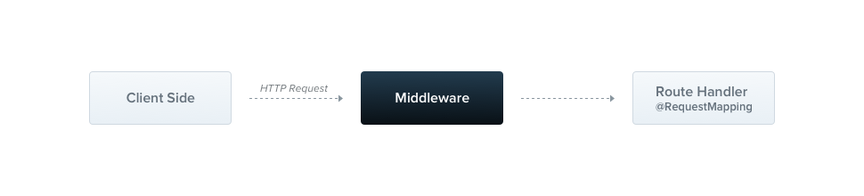

### Middleware / Middleware

Middleware ist eine Funktion, die vor dem Routen-Handler aufgerufen wird. Middleware-Funktionen haben Zugriff auf die Request- und Response-Objekte sowie die nächste Middleware-Funktion im Anwendungszyklus. Die nächste Middleware-Funktion wird üblicherweise durch eine Variable namens `next` bezeichnet.



Nest-Middleware entspricht standardmäßig der Express-Middleware. Die folgende Beschreibung aus der offiziellen Express-Dokumentation erklärt die Fähigkeiten von Middleware:

Middleware-Funktionen können folgende Aufgaben erfüllen:
- Ausführen von beliebigem Code.
- Änderungen an den Request- und Response-Objekten vornehmen.
- Den Request-Response-Zyklus beenden.
- Die nächste Middleware-Funktion im Stapel aufrufen.
- Wenn die aktuelle Middleware-Funktion den Request-Response-Zyklus nicht beendet, muss sie `next()` aufrufen, um die Kontrolle an die nächste Middleware-Funktion zu übergeben. Andernfalls bleibt der Request hängen.

### Eigene Nest-Middleware implementieren

Sie können eigene Nest-Middleware entweder als Funktion oder als Klasse mit einem `@Injectable()` Dekorator implementieren. Die Klasse sollte das `NestMiddleware`-Interface implementieren, während die Funktion keine besonderen Anforderungen hat. Beginnen wir mit der Implementierung einer einfachen Middleware-Funktion mittels der Klassenmethode.

#### Beispiel: LoggerMiddleware

```typescript
import { Injectable, NestMiddleware } from '@nestjs/common';
import { Request, Response, NextFunction } from 'express';

@Injectable()
export class LoggerMiddleware implements NestMiddleware {
  use(req: Request, res: Response, next: NextFunction) {
    console.log('Request...');
    next();
  }
}
```

### Dependency Injection

Nest-Middleware unterstützt vollumfänglich Dependency Injection. Genau wie bei Providern und Controllern können auch Middleware-Abhängigkeiten injiziert werden, die innerhalb desselben Moduls verfügbar sind. Dies geschieht wie üblich über den Konstruktor.

### Middleware anwenden / Applying middleware

Middleware wird nicht im `@Module()` Dekorator definiert. Stattdessen richten wir sie über die `configure()` Methode der Modulklasse ein. Module, die Middleware enthalten, müssen das `NestModule`-Interface implementieren. Richten wir die `LoggerMiddleware` auf Modulebene ein.

#### Beispiel: AppModule

```typescript
import { Module, NestModule, MiddlewareConsumer } from '@nestjs/common';
import { LoggerMiddleware } from './common/middleware/logger.middleware';
import { CatsModule } from './cats/cats.module';

@Module({
  imports: [CatsModule],
})
export class AppModule implements NestModule {
  configure(consumer: MiddlewareConsumer) {
    consumer
      .apply(LoggerMiddleware)
      .forRoutes('cats');
  }
}
```

Im obigen Beispiel haben wir die `LoggerMiddleware` für die `/cats`-Routenhandler eingerichtet, die zuvor im `CatsController` definiert wurden. Wir können eine Middleware auch auf eine bestimmte Anfragemethode beschränken, indem wir ein Objekt mit dem Routenpfad und der Anfragemethode an die `forRoutes()` Methode übergeben.

#### Beispiel: Beschränkung auf GET-Anfragen

```typescript
import { Module, NestModule, RequestMethod, MiddlewareConsumer } from '@nestjs/common';
import { LoggerMiddleware } from './common/middleware/logger.middleware';
import { CatsModule } from './cats/cats.module';

@Module({
  imports: [CatsModule],
})
export class AppModule implements NestModule {
  configure(consumer: MiddlewareConsumer) {
    consumer
      .apply(LoggerMiddleware)
      .forRoutes({ path: 'cats', method: RequestMethod.GET });
  }
}
```

### Weitere Hinweise und Warnungen

- Die `configure()` Methode kann asynchron gemacht werden, indem async/await verwendet wird.
- Wenn der Express-Adapter verwendet wird, registriert die NestJS-App standardmäßig `json` und `urlencoded` aus dem Paket `body-parser`. Möchte man dieses Middleware über den `MiddlewareConsumer` anpassen, muss die globale Middleware durch Setzen der `bodyParser`-Flag auf `false` beim Erstellen der Anwendung mit `NestFactory.create()` deaktiviert werden.

### Routenmuster / Route wildcards

Musterbasierte Routen werden ebenfalls unterstützt. Zum Beispiel wird der Asterisk (*) als Platzhalter verwendet und passt auf jede Kombination von Zeichen.

#### Beispiel: Wildcard-Routen

```typescript
forRoutes({ path: 'ab*cd', method: RequestMethod.ALL });
```

### Middleware Consumer / Middleware consumer

Der `MiddlewareConsumer` ist eine Hilfsklasse, die mehrere integrierte Methoden zur Verwaltung von Middleware bietet. Alle Methoden können im Fluent-Stil verkettet werden. Die `forRoutes()` Methode kann einen einzelnen String, mehrere Strings, ein `RouteInfo`-Objekt, eine Controller-Klasse und sogar mehrere Controller-Klassen entgegennehmen.

#### Beispiel: Anwendung auf einen Controller

```typescript
import { Module, NestModule, MiddlewareConsumer } from '@nestjs/common';
import { LoggerMiddleware } from './common/middleware/logger.middleware';
import { CatsModule } from './cats/cats.module';
import { CatsController } from './cats/cats.controller';

@Module({
  imports: [CatsModule],
})
export class AppModule implements NestModule {
  configure(consumer: MiddlewareConsumer) {
    consumer
      .apply(LoggerMiddleware)
      .forRoutes(CatsController);
  }
}
```

### Ausschließen von Routen / Excluding routes

Manchmal möchten wir bestimmte Routen von der Anwendung der Middleware ausschließen. Dies können wir leicht mit der `exclude()` Methode tun.

#### Beispiel: Ausschließen von Routen

```typescript
consumer
  .apply(LoggerMiddleware)
  .exclude(
    { path: 'cats', method: RequestMethod.GET },
    { path: 'cats', method: RequestMethod.POST },
    'cats/(.*)',
  )
  .forRoutes(CatsController);
```

### Funktionale Middleware / Functional middleware

Die `LoggerMiddleware` Klasse, die wir verwendet haben, ist recht einfach. Sie hat keine Mitglieder, keine zusätzlichen Methoden und keine Abhängigkeiten. Warum definieren wir sie nicht einfach als Funktion? Tatsächlich können wir das. Diese Art von Middleware wird als funktionale Middleware bezeichnet.

#### Beispiel: Funktionale Middleware

```typescript
import { Request, Response, NextFunction } from 'express';

export function logger(req: Request, res: Response, next: NextFunction) {
  console.log('Request...');
  next();
};
```

### Globale Middleware / Multiple middleware

Wenn wir Middleware auf alle registrierten Routen auf einmal anwenden wollen, können wir die `use()` Methode der `INestApplication` Instanz verwenden.

#### Beispiel: Globale Middleware / Global middleware

```typescript
const app = await NestFactory.create(AppModule);
app.use(logger);
await app.listen(3000);
```

### Hinweis

Der Zugriff auf den DI-Container in einer globalen Middleware ist nicht möglich. Sie können stattdessen eine funktionale Middleware verwenden, wenn Sie `app.use()` verwenden. Alternativ können Sie eine Klassen-Middleware verwenden und diese mit `.forRoutes('*')` innerhalb des AppModule (oder eines anderen Moduls) einbinden.

