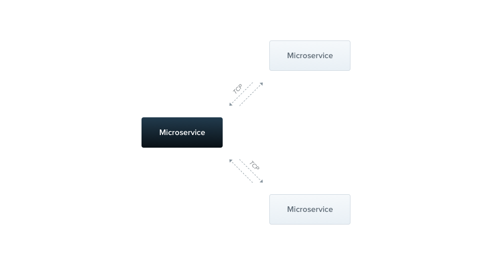

# Übersicht / Overview

Zusätzlich zu den traditionellen (manchmal auch monolithisch genannten) Anwendungsarchitekturen unterstützt Nest nativ den mikroserviceorientierten Entwicklungsstil. Die meisten der in dieser Dokumentation behandelten Konzepte, wie Dependency Injection, Dekoratoren, Ausnahmefilter, Pipes, Guards und Interceptoren, gelten gleichermaßen für Microservices. Wo immer möglich, abstrahiert Nest Implementierungsdetails, sodass dieselben Komponenten sowohl auf HTTP-basierten Plattformen, WebSockets als auch in Microservices laufen können. Dieser Abschnitt behandelt die Aspekte von Nest, die spezifisch für Microservices sind.



In Nest ist ein Microservice grundsätzlich eine Anwendung, die eine andere Transportschicht als HTTP verwendet.

Nest unterstützt mehrere eingebaute Transportschicht-Implementierungen, sogenannte Transporter, die für die Übertragung von Nachrichten zwischen verschiedenen Microservice-Instanzen verantwortlich sind. Die meisten Transporter unterstützen nativ sowohl Request-Response- als auch Event-basierte Nachrichtenstile. Nest abstrahiert die Implementierungsdetails jedes Transporters hinter einer kanonischen Schnittstelle sowohl für Request-Response- als auch für Event-basierte Nachrichtenübermittlung. Dies erleichtert das Wechseln von einer Transportschicht zu einer anderen – zum Beispiel, um die spezifischen Zuverlässigkeits- oder Leistungsmerkmale einer bestimmten Transportschicht zu nutzen – ohne dass Ihr Anwendungscode betroffen ist.

## Installation / Installation#

Um mit dem Aufbau von Microservices zu beginnen, installieren Sie zunächst das erforderliche Paket:

```bash
$ npm i --save @nestjs/microservices
```

## Erste Schritte / Getting started#

Um einen Microservice zu instanziieren, verwenden Sie die Methode createMicroservice() der NestFactory-Klasse:

```typescript
// main.ts

import { NestFactory } from '@nestjs/core';
import { Transport, MicroserviceOptions } from '@nestjs/microservices';
import { AppModule } from './app.module';

async function bootstrap() {
  const app = await NestFactory.createMicroservice<MicroserviceOptions>(
    AppModule,
    {
      transport: Transport.TCP,
    },
  );
  await app.listen();
}
bootstrap();
```

**HINWEIS**
Microservices verwenden standardmäßig die TCP-Transportschicht.

Das zweite Argument der Methode createMicroservice() ist ein Optionsobjekt. Dieses Objekt kann aus zwei Mitgliedern bestehen:

- **transport**: Gibt den Transporter an (zum Beispiel, Transport.NATS)
- **options**: Ein transporterspezifisches Optionsobjekt, das das Verhalten des Transporters bestimmt.

Das Optionsobjekt ist spezifisch für den gewählten Transporter. Der TCP-Transporter bietet die unten beschriebenen Eigenschaften. Für andere Transporter (z.B. Redis, MQTT, etc.) siehe das entsprechende Kapitel für eine Beschreibung der verfügbaren Optionen.

- **host**: Verbindungs-Hostname
- **port**: Verbindungs-Port
- **retryAttempts**: Anzahl der Wiederholungsversuche (Standard: 0)
- **retryDelay**: Verzögerung zwischen den Wiederholungsversuchen (ms) (Standard: 0)
- **serializer**: Benutzerdefinierter Serializer für ausgehende Nachrichten
- **deserializer**: Benutzerdefinierter Deserializer für eingehende Nachrichten
- **socketClass**: Eine benutzerdefinierte Socket-Klasse, die TcpSocket erweitert (Standard: JsonSocket)
- **tlsOptions**: Optionen zur Konfiguration des TLS-Protokolls

## Muster / Patterns#

Microservices erkennen sowohl Nachrichten als auch Ereignisse anhand von Mustern. Ein Muster ist ein einfacher Wert, z.B. ein Literalobjekt oder ein String. Muster werden automatisch serialisiert und zusammen mit dem Datenanteil einer Nachricht über das Netzwerk gesendet. Auf diese Weise können Nachrichtensender und -empfänger koordinieren, welche Anfragen von welchen Handlern verarbeitet werden.

## Request-Response / Request-response#

Der Request-Response-Nachrichtenstil ist nützlich, wenn Sie Nachrichten zwischen verschiedenen externen Diensten austauschen müssen. Mit diesem Paradigma können Sie sicherstellen, dass der Dienst die Nachricht tatsächlich empfangen hat (ohne dass Sie ein Nachrichten-ACK-Protokoll manuell implementieren müssen). Das Request-Response-Paradigma ist jedoch nicht immer die beste Wahl. Zum Beispiel sind Streaming-Transporter, die logbasierte Persistenz verwenden, wie Kafka oder NATS-Streaming, für die Lösung eines anderen Bereichs von Problemen optimiert, die eher einem Event-Messaging-Paradigma entsprechen (siehe unten für mehr Details zu Event-basiertem Messaging).

Um den Request-Response-Nachrichtentyp zu aktivieren, erstellt Nest zwei logische Kanäle - einer ist für die Datenübertragung verantwortlich, während der andere auf eingehende Antworten wartet. Für einige zugrunde liegende Transporte, wie NATS, wird diese Dual-Channel-Unterstützung out-of-the-box bereitgestellt. Für andere erstellt Nest manuell separate Kanäle. Dies kann einen Overhead verursachen, daher sollten Sie, wenn Sie keinen Request-Response-Nachrichtenstil benötigen, die Event-basierte Methode in Betracht ziehen.

Um einen Nachrichtenhandler basierend auf dem Request-Response-Paradigma zu erstellen, verwenden Sie den Dekorator @MessagePattern(), der aus dem Paket @nestjs/microservices importiert wird. Dieser Dekorator sollte nur innerhalb der Controller-Klassen verwendet werden, da diese die Einstiegspunkte für Ihre Anwendung sind. Die Verwendung innerhalb von Providern hat keine Wirkung, da sie von der Nest-Laufzeit einfach ignoriert werden.

```typescript
// math.controller.ts

import { Controller } from '@nestjs/common';
import { MessagePattern } from '@nestjs/microservices';

@Controller()
export class MathController {
  @MessagePattern({ cmd: 'sum' })
  accumulate(data: number[]): number {
    return (data || []).reduce((a, b) => a + b);
  }
}
```

Im obigen Code hört der Nachrichtenhandler accumulate() auf Nachrichten, die das Muster { cmd: 'sum' } erfüllen. Der Nachrichtenhandler nimmt ein einzelnes Argument entgegen, die vom Client übergebenen Daten. In diesem Fall sind die Daten ein Array von Zahlen, die aufsummiert werden sollen.

## Asynchrone Antworten / Asynchronous responses#

Nachrichtenhandler können entweder synchron oder asynchron antworten. Daher werden async-Methoden unterstützt.

```typescript
@MessagePattern({ cmd: 'sum' })
async accumulate(data: number[]): Promise<number> {
  return (data || []).reduce((a, b) => a + b);
}
```

Ein Nachrichtenhandler kann auch ein Observable zurückgeben, in welchem Fall die Ergebniswerte ausgegeben werden, bis der Stream abgeschlossen ist.

```typescript
@MessagePattern({ cmd: 'sum' })
accumulate(data: number[]): Observable<number> {
  return from([1, 2, 3]);
}
```

Im obigen Beispiel wird der Nachrichtenhandler 3 Mal antworten (mit jedem Element aus dem Array).

## Event-basiert / Event-based#

Während die Request-Response-Methode ideal für den Austausch von Nachrichten zwischen Diensten ist, ist sie weniger geeignet, wenn Ihr Nachrichtenstil Event-basiert ist - wenn Sie einfach nur Ereignisse veröffentlichen möchten, ohne auf eine Antwort zu warten. In diesem Fall möchten Sie nicht den Overhead, der durch die Aufrechterhaltung von zwei Kanälen erforderlich ist.

Angenommen, Sie möchten einfach einen anderen Dienst benachrichtigen, dass eine bestimmte Bedingung in diesem Teil des Systems aufgetreten ist. Dies ist der ideale Anwendungsfall für den Event-basierten Nachrichtenstil.

Um einen Ereignishandler zu erstellen, verwenden wir den Dekorator @EventPattern(), der aus dem Paket @nestjs/microservices importiert wird.

```typescript
@EventPattern('user_created')
async handleUserCreated(data: Record<string, unknown>) {
  // Geschäftslogik
}
```

**HINWEIS**
Sie können mehrere Ereignishandler für ein einzelnes Ereignismuster registrieren und alle werden automatisch parallel ausgelöst.

Der Ereignishandler handleUserCreated() hört auf das Ereignis 'user_created'. Der Ereignishandler nimmt ein einzelnes Argument entgegen, die vom Client übergebenen Daten (in diesem Fall eine Ereignis-Nutzlast, die über das Netzwerk gesendet wurde).

## Dekoratoren / Decorators#

In komplexeren Szenarien möchten Sie möglicherweise auf mehr Informationen über die eingehende Anfrage zugreifen. Zum Beispiel möchten Sie im Fall von NATS mit Wildcard-Abonnements das ursprüngliche Thema erhalten, an das der Produzent die Nachricht gesendet hat. Ebenso möchten Sie in Kafka möglicherweise auf die Nachricht-Header zugreifen. Um dies zu erreichen, können Sie die eingebauten Dekoratoren wie folgt verwenden:

```typescript
@MessagePattern('time.us.*')
getDate(@Payload() data: number[], @Ctx() context: NatsContext) {
  console.log(`Subject: ${context.getSubject()}`); // z.B. "time.us.east"
  return new Date().toLocaleTimeString(...);
}
```

**HINWEIS**
@Payload(), @Ctx() und NatsContext werden aus @nestjs/microservices importiert.

**HINWEIS**
Sie können auch einen Eigenschaftsschlüssel an den @Payload() Dekorator übergeben, um eine bestimmte Eigenschaft aus dem eingehenden Nutzlastobjekt zu extrahieren, zum Beispiel @Payload('id').

## Client / Client#

Eine Client-Nest-Anwendung kann Nachrichten austauschen oder Ereignisse an einen Nest-Microservice veröffentlichen, indem sie die Klasse ClientProxy verwendet. Diese Klasse definiert mehrere Methoden, wie send() (für Request-Response-Messaging) und emit() (für Event-getriebenes Messaging), mit denen Sie mit einem entfernten Microservice kommunizieren können. Sie können eine Instanz dieser Klasse auf eine der folgenden Arten erhalten

.

Eine Technik besteht darin, das ClientsModule zu importieren, das die statische Methode register() bereitstellt. Diese Methode nimmt ein Argument entgegen, das ein Array von Objekten darstellt, die Microservice-Transporter repräsentieren. Jedes dieser Objekte hat eine name-Eigenschaft, eine optionale transport-Eigenschaft (Standard ist Transport.TCP) und eine optionale transporterspezifische options-Eigenschaft.

Die name-Eigenschaft dient als Injektionstoken, das verwendet werden kann, um eine Instanz von ClientProxy bei Bedarf zu injizieren. Der Wert der name-Eigenschaft als Injektionstoken kann eine beliebige Zeichenkette oder ein JavaScript-Symbol sein, wie [hier](https://docs.nestjs.com/fundamentals/custom-providers#non-class-based-provider-tokens) beschrieben.

Die options-Eigenschaft ist ein Objekt mit denselben Eigenschaften, die wir bereits in der Methode createMicroservice() gesehen haben.

```typescript
@Module({
  imports: [
    ClientsModule.register([
      { name: 'MATH_SERVICE', transport: Transport.TCP },
    ]),
  ]
  ...
})
```

Sobald das Modul importiert wurde, können wir eine Instanz von ClientProxy injizieren, die wie angegeben über die 'MATH_SERVICE'-Transporteroptionen konfiguriert wurde, indem wir den Dekorator @Inject() verwenden.

```typescript
constructor(
  @Inject('MATH_SERVICE') private client: ClientProxy,
) {}
```

**HINWEIS**
Das ClientsModule und die Klasse ClientProxy werden aus dem Paket @nestjs/microservices importiert.

Manchmal müssen wir die Transporter-Konfiguration von einem anderen Dienst (z.B. einem ConfigService) abrufen, anstatt sie in unserer Client-Anwendung fest zu kodieren. Um dies zu tun, können wir einen benutzerdefinierten Anbieter registrieren, der die Klasse ClientProxyFactory verwendet. Diese Klasse hat eine statische Methode create(), die ein Transporteroptionsobjekt akzeptiert und eine angepasste ClientProxy-Instanz zurückgibt.

```typescript
@Module({
  providers: [
    {
      provide: 'MATH_SERVICE',
      useFactory: (configService: ConfigService) => {
        const mathSvcOptions = configService.getMathSvcOptions();
        return ClientProxyFactory.create(mathSvcOptions);
      },
      inject: [ConfigService],
    }
  ]
  ...
})
```

**HINWEIS**
Die ClientProxyFactory wird aus dem Paket @nestjs/microservices importiert.

Eine weitere Option ist die Verwendung des @Client() Eigenschaftsdekorators.

```typescript
@Client({ transport: Transport.TCP })
client: ClientProxy;
```

**HINWEIS**
Der Dekorator @Client() wird aus dem Paket @nestjs/microservices importiert.

Die Verwendung des Dekorators @Client() ist nicht die bevorzugte Technik, da es schwieriger zu testen und schwieriger ist, eine Client-Instanz zu teilen.

Der ClientProxy ist lazy. Er stellt nicht sofort eine Verbindung her. Stattdessen wird die Verbindung vor dem ersten Microservice-Aufruf hergestellt und dann bei jedem nachfolgenden Aufruf wiederverwendet. Wenn Sie jedoch den Bootstrapping-Prozess der Anwendung verzögern möchten, bis eine Verbindung hergestellt ist, können Sie manuell eine Verbindung mit der connect()-Methode des ClientProxy-Objekts innerhalb des OnApplicationBootstrap-Lebenszyklus-Hooks initiieren.

```typescript
async onApplicationBootstrap() {
  await this.client.connect();
}
```

Wenn die Verbindung nicht hergestellt werden kann, lehnt die Methode connect() mit dem entsprechenden Fehlerobjekt ab.

## Nachrichten senden / Sending messages#

Die Klasse ClientProxy stellt die Methode send() zur Verfügung. Diese Methode ist dafür gedacht, den Microservice aufzurufen und gibt ein Observable mit seiner Antwort zurück. Somit können wir leicht die ausgegebenen Werte abonnieren.

```typescript
accumulate(): Observable<number> {
  const pattern = { cmd: 'sum' };
  const payload = [1, 2, 3];
  return this.client.send<number>(pattern, payload);
}
```

Die Methode send() nimmt zwei Argumente entgegen, pattern und payload. Das pattern sollte eines sein, das in einem @MessagePattern() Dekorator definiert ist. Das payload ist eine Nachricht, die wir an den entfernten Microservice übermitteln möchten. Diese Methode gibt ein kaltes Observable zurück, was bedeutet, dass Sie es explizit abonnieren müssen, bevor die Nachricht gesendet wird.

## Ereignisse veröffentlichen / Publishing events#

Um ein Ereignis zu senden, verwenden Sie die Methode emit() des ClientProxy-Objekts. Diese Methode veröffentlicht ein Ereignis an den Nachrichtenbroker.

```typescript
async publish() {
  this.client.emit<number>('user_created', new UserCreatedEvent());
}
```

Die Methode emit() nimmt zwei Argumente entgegen, pattern und payload. Das pattern sollte eines sein, das in einem @EventPattern() Dekorator definiert ist. Das payload ist eine Ereignisnutzlast, die wir an den entfernten Microservice übermitteln möchten. Diese Methode gibt ein heißes Observable zurück (im Gegensatz zu dem kalten Observable, das von send() zurückgegeben wird), was bedeutet, dass der Proxy sofort versucht, das Ereignis zu liefern, unabhängig davon, ob Sie das Observable explizit abonnieren oder nicht.

## Scopes / Scopes

Für Menschen aus verschiedenen Programmierhintergründen mag es unerwartet sein zu erfahren, dass in Nest fast alles über eingehende Anfragen hinweg geteilt wird. Wir haben einen Verbindungspool zur Datenbank, Singleton-Dienste mit globalem Zustand usw. Denken Sie daran, dass Node.js nicht dem Request/Response-Multi-Threaded-Stateless-Modell folgt, bei dem jede Anfrage von einem separaten Thread verarbeitet wird. Daher ist die Verwendung von Singleton-Instanzen für unsere Anwendungen vollständig sicher.

Es gibt jedoch Grenzfälle, in denen eine auf Anfragen basierende Lebensdauer des Handlers das gewünschte Verhalten sein kann, z.B. pro Anforderung Caching in GraphQL-Anwendungen, Anfragenverfolgung oder Multi-Tenancy. Erfahren Sie hier, wie Sie Scopes steuern können.

Anfragegebundene Handler und Anbieter können RequestContext mit dem @Inject() Dekorator in Kombination mit dem CONTEXT-Token injizieren:

```typescript
import { Injectable, Scope, Inject } from '@nestjs/common';
import { CONTEXT, RequestContext } from '@nestjs/microservices';

@Injectable({ scope: Scope.REQUEST })
export class CatsService {
  constructor(@Inject(CONTEXT) private ctx: RequestContext) {}
}
```

Dies ermöglicht den Zugriff auf das RequestContext-Objekt, das zwei Eigenschaften hat:

```typescript
export interface RequestContext<T = any> {
  pattern: string | Record<string, any>;
  data: T;
}
```

Die Eigenschaft `data` ist die vom Nachrichtenproduzenten gesendete Nachrichtennutzlast. Die Eigenschaft `pattern` ist das Muster, das verwendet wird, um einen geeigneten Handler zur Verarbeitung der eingehenden Nachricht zu identifizieren.

### Umgang mit Zeitüberschreitungen / Handling timeouts

In verteilten Systemen kann es vorkommen, dass Microservices ausfallen oder nicht verfügbar sind. Um endloses Warten zu vermeiden, können Sie Zeitüberschreitungen verwenden. Ein Timeout ist ein unglaublich nützliches Muster bei der Kommunikation mit anderen Diensten. Um Zeitüberschreitungen auf Ihre Microservice-Aufrufe anzuwenden, können Sie den RxJS-Operator timeout verwenden. Wenn der Microservice nicht innerhalb einer bestimmten Zeit auf die Anfrage antwortet, wird eine Ausnahme ausgelöst, die angemessen abgefangen und behandelt werden kann.

Um dieses Problem zu lösen, müssen Sie das rxjs-Paket verwenden. Verwenden Sie einfach den timeout-Operator in der Pipe:

```typescript
this.client
  .send<TResult, TInput>(pattern, data)
  .pipe(timeout(5000));
```

**HINWEIS**
Der timeout-Operator wird aus dem Paket rxjs/operators importiert.

Nach 5 Sekunden, wenn der Microservice nicht antwortet, wird ein Fehler ausgelöst.
