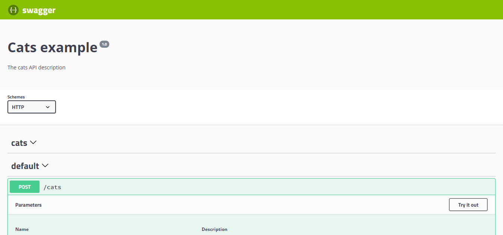

# Einführung / Introduction
# swagger 

Die OpenAPI-Spezifikation ist ein sprachunabhängiges Definitionsformat zur Beschreibung von RESTful APIs. Nest bietet ein dediziertes Modul, das die Generierung einer solchen Spezifikation durch die Nutzung von Decorators ermöglicht.

# Installation / Installation

Um es zu verwenden, installieren wir zuerst die erforderliche Abhängigkeit.

```bash
$ npm install --save @nestjs/swagger
```

# Start / Bootstrap

Sobald der Installationsprozess abgeschlossen ist, öffnen Sie die main.ts-Datei und initialisieren Swagger mithilfe der SwaggerModule-Klasse:

main.tsJS

```javascript
import { NestFactory } from '@nestjs/core';
import { SwaggerModule, DocumentBuilder } from '@nestjs/swagger';
import { AppModule } from './app.module';

async function bootstrap() {
  const app = await NestFactory.create(AppModule);

  const config = new DocumentBuilder()
    .setTitle('Cats example')
    .setDescription('The cats API description')
    .setVersion('1.0')
    .addTag('cats')
    .build();
  const document = SwaggerModule.createDocument(app, config);
  SwaggerModule.setup('api', app, document);

  await app.listen(3000);
}
bootstrap();
```

HINWEIS / HINT

Das von der Methode SwaggerModule#createDocument() zurückgegebene Dokument ist ein serialisierbares Objekt, das dem OpenAPI-Dokument entspricht. Anstatt es über HTTP zu hosten, können Sie es auch als JSON/YAML-Datei speichern und auf verschiedene Weise verwenden. Der DocumentBuilder hilft, ein Basisdokument zu strukturieren, das der OpenAPI-Spezifikation entspricht. Er bietet mehrere Methoden, um Eigenschaften wie Titel, Beschreibung, Version usw. festzulegen. Um ein vollständiges Dokument zu erstellen (mit allen definierten HTTP-Routen), verwenden wir die Methode createDocument() der SwaggerModule-Klasse. Diese Methode benötigt zwei Argumente, eine Anwendungsinstanz und ein Swagger-Optionsobjekt. Alternativ können wir ein drittes Argument angeben, das vom Typ SwaggerDocumentOptions sein sollte. Mehr dazu im Abschnitt Dokumentoptionen.

Sobald wir ein Dokument erstellt haben, können wir die setup()-Methode aufrufen. Sie akzeptiert:

- Den Pfad, um die Swagger UI zu mounten
- Eine Anwendungsinstanz
- Das oben instanzierte Dokumentobjekt
- Optionales Konfigurationsparameter (mehr dazu [hier](https://docs.nestjs.com/openapi/introduction#setup-options))

Jetzt können Sie den folgenden Befehl ausführen, um den HTTP-Server zu starten:

```bash
$ npm run start
```

Während die Anwendung läuft, öffnen Sie Ihren Browser und navigieren Sie zu http://localhost:3000/api. Sie sollten die Swagger UI sehen.



Wie Sie sehen können, spiegelt das SwaggerModule automatisch alle Ihre Endpunkte wider.

HINWEIS / HINT

Um eine Swagger JSON-Datei zu generieren und herunterzuladen, navigieren Sie zu http://localhost:3000/api-json (vorausgesetzt, Ihre Swagger-Dokumentation ist unter http://localhost:3000/api verfügbar).

WARNUNG / WARNING

Bei Verwendung von fastify und helmet kann es ein Problem mit CSP geben. Um diesen Konflikt zu lösen, konfigurieren Sie die CSP wie unten gezeigt:

```javascript
app.register(helmet, {
  contentSecurityPolicy: {
    directives: {
      defaultSrc: [`'self'`],
      styleSrc: [`'self'`, `'unsafe-inline'`],
      imgSrc: [`'self'`, 'data:', 'validator.swagger.io'],
      scriptSrc: [`'self'`, `https: 'unsafe-inline'`],
    },
  },
});

// Wenn Sie CSP überhaupt nicht verwenden möchten, können Sie dies verwenden:
app.register(helmet, {
  contentSecurityPolicy: false,
});
```

# Dokumentoptionen / Document options

Beim Erstellen eines Dokuments ist es möglich, einige zusätzliche Optionen anzugeben, um das Verhalten der Bibliothek zu optimieren. Diese Optionen sollten vom Typ SwaggerDocumentOptions sein, welche wie folgt sein können:

```typescript
export interface SwaggerDocumentOptions {
  /**
   * Liste der Module, die in die Spezifikation aufgenommen werden sollen
   */
  include?: Function[];

  /**
   * Zusätzliche, extra Modelle, die inspiziert und in die Spezifikation aufgenommen werden sollen
   */
  extraModels?: Function[];

  /**
   * Wenn `true`, wird Swagger das globale Präfix ignorieren, das über die Methode `setGlobalPrefix()` gesetzt wurde
   */
  ignoreGlobalPrefix?: boolean;

  /**
   * Wenn `true`, wird Swagger auch Routen aus den von `include`-Modulen importierten Modulen laden
   */
  deepScanRoutes?: boolean;

  /**
   * Benutzerdefinierte operationIdFactory, die verwendet wird, um die `operationId` basierend auf dem `controllerKey` und `methodKey` zu generieren
   * @default () => controllerKey_methodKey
   */
  operationIdFactory?: (controllerKey: string, methodKey: string) => string;
}
```

Zum Beispiel, wenn Sie sicherstellen möchten, dass die Bibliothek Operationsnamen wie createUser anstatt UserController_createUser generiert, können Sie Folgendes festlegen:

```typescript
const options: SwaggerDocumentOptions =  {
  operationIdFactory: (
    controllerKey: string,
    methodKey: string
  ) => methodKey
};
const document = SwaggerModule.createDocument(app, config, options);
```

# Setup-Optionen / Setup options

Sie können Swagger UI konfigurieren, indem Sie das Optionsobjekt, das das SwaggerCustomOptions-Interface erfüllt, als viertes Argument der SwaggerModule#setup-Methode übergeben.

```typescript
export interface SwaggerCustomOptions {
  /**
   * Wenn `true`, werden Swagger-Ressourcenpfade durch das über `setGlobalPrefix()` gesetzte globale Präfix vorangestellt.
   * Standard: `false`.
   * @see https://docs.nestjs.com/faq/global-prefix
   */
  useGlobalPrefix?: boolean;

  /**
   * Wenn `false`, werden nur API-Definitionen (JSON und YAML) bereitgestellt (unter `/{path}-json` und `/{path}-yaml`).
   * Dies ist besonders nützlich, wenn Sie bereits eine Swagger UI irgendwo anders hosten und nur API-Definitionen bereitstellen möchten.
   * Standard: `true`.
   */
  swaggerUiEnabled?: boolean;

  /**
   * URL, um die API-Definition in Swagger UI zu laden.
   */
  swaggerUrl?: string;

  /**
   * Pfad der bereitzustellenden JSON-API-Definition.
   * Standard: `<path>-json`.
   */
  jsonDocumentUrl?: string;

  /**
   * Pfad der bereitzustellenden YAML-API-Definition.
   * Standard: `<path>-yaml`.
   */
  yamlDocumentUrl?: string;

  /**
   * Hook, der es ermöglicht, das OpenAPI-Dokument vor der Bereitstellung zu ändern.
   * Es wird nach der Generierung des Dokuments und vor der Bereitstellung als JSON & YAML aufgerufen.
   */
  patchDocumentOnRequest?: <TRequest = any, TResponse = any>(
    req: TRequest,
    res: TResponse,
    document: OpenAPIObject
  ) => OpenAPIObject;

  /**
   * Wenn `true`, wird der Selektor der OpenAPI-Definitionen in der Swagger UI-Oberfläche angezeigt.
   * Standard: `false`.
   */
  explorer?: boolean;

  /**
   * Zusätzliche Swagger UI-Optionen
   */
  swaggerOptions?: SwaggerUiOptions;

  /**
   * Benutzerdefinierte CSS-Stile, die in die Swagger UI-Seite eingefügt werden sollen.
   */
  customCss?: string;

  /**
   * URL(s) eines benutzerdefinierten CSS-Stylesheets, das in die Swagger UI-Seite geladen werden soll.
   */
  customCssUrl?: string | string[];

  /**
   * URL(s) benutzerdefinierter JavaScript-Dateien, die in die Swagger UI-Seite geladen werden sollen.
   */
  customJs?: string | string[];

  /**
   * Benutzerdefinierte JavaScript-Skripte, die in die Swagger UI-Seite geladen werden sollen.
   */
  customJsStr?: string | string[];

  /**
   * Benutzerdefiniertes Favicon für die Swagger UI-Seite.
   */
  customfavIcon?: string;

  /**
   * Benutzerdefinierter Titel für die Swagger UI-Seite.
   */
  customSiteTitle?: string;

  /**
   * Dateisystempfad (z.B.: ./node_modules/swagger-ui-dist) mit statischen Swagger UI-Assets.
   */
  customSwaggerUiPath?: string;

  /**
   * @deprecated Diese Eigenschaft hat keine Wirkung.
   */
  validatorUrl?: string;

  /**
   * @deprecated Diese Eigenschaft hat keine Wirkung.
   */
  url?: string;

  /**
   * @deprecated Diese Eigenschaft hat keine Wirkung.
   */
  urls?: Record<'url' | 'name', string>[];
}
```

# Beispiel / Example

Ein funktionierendes Beispiel ist [hier](https://github.com/nestjs/nest/tree/master/sample/11-swagger) verfügbar.
