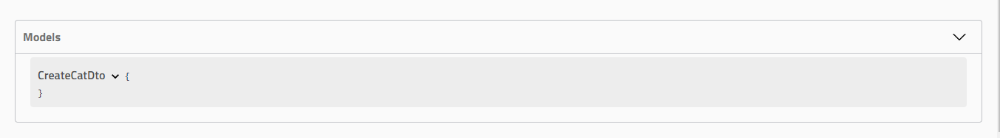
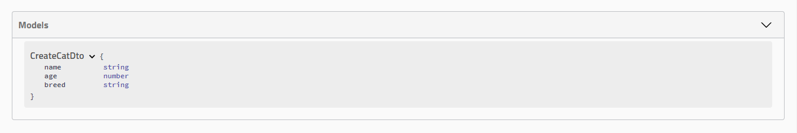
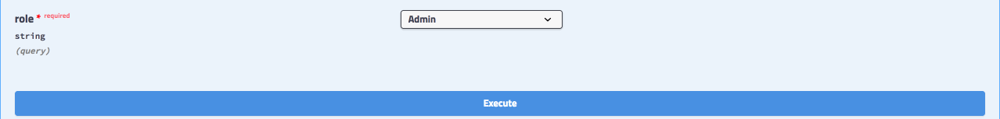
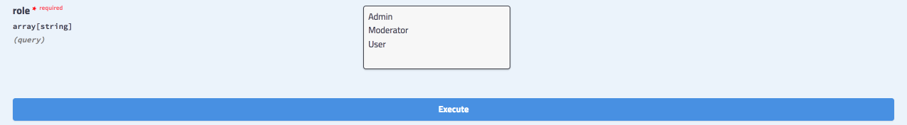

# Typen und Parameter / Types and parameters

Das SwaggerModule durchsucht alle @Body(), @Query() und @Param() Dekoratoren in Rout-Handlern, um das API-Dokument zu generieren. Es erstellt auch entsprechende Modelldefinitionen durch Nutzung von Reflection. Betrachten Sie den folgenden Code:

```typescript
@Post()
async create(@Body() createCatDto: CreateCatDto) {
  this.catsService.create(createCatDto);
}
```

HINWEIS / HINT

Um die Body-Definition explizit festzulegen, verwenden Sie den @ApiBody() Dekorator (importiert aus dem @nestjs/swagger-Paket). Basierend auf dem CreateCatDto wird die folgende Modelldefinition in der Swagger UI erstellt:



Wie Sie sehen können, ist die Definition leer, obwohl die Klasse einige deklarierte Eigenschaften hat. Um die Eigenschaften der Klasse im SwaggerModule sichtbar zu machen, müssen wir sie entweder mit dem @ApiProperty() Dekorator annotieren oder das CLI-Plugin verwenden (lesen Sie mehr im Plugin-Abschnitt), das dies automatisch erledigt:

```typescript
import { ApiProperty } from '@nestjs/swagger';

export class CreateCatDto {
  @ApiProperty()
  name: string;

  @ApiProperty()
  age: number;

  @ApiProperty()
  breed: string;
}
```

HINWEIS / HINT

Statt jede Eigenschaft manuell zu annotieren, sollten Sie das Swagger-Plugin verwenden (siehe Plugin-Abschnitt), das dies automatisch für Sie erledigt. Öffnen wir den Browser und überprüfen das generierte CreateCatDto-Modell:



Zusätzlich ermöglicht der @ApiProperty() Dekorator das Festlegen verschiedener Schema-Objekt-Eigenschaften:

```typescript
@ApiProperty({
  description: 'The age of a cat',
  minimum: 1,
  default: 1,
})
age: number;
```

HINWEIS / HINT

Statt explizit @ApiProperty({ required: false }) zu schreiben, können Sie den @ApiPropertyOptional() Kurz-Dekorator verwenden. Um den Typ der Eigenschaft explizit festzulegen, verwenden Sie den Schlüssel type:

```typescript
@ApiProperty({
  type: Number,
})
age: number;
```

# Arrays / Arrays

Wenn die Eigenschaft ein Array ist, müssen wir den Array-Typ manuell angeben, wie unten gezeigt:

```typescript
@ApiProperty({ type: [String] })
names: string[];
```

HINWEIS / HINT

Verwenden Sie das Swagger-Plugin (siehe Plugin-Abschnitt), das Arrays automatisch erkennt. Entweder geben Sie den Typ als erstes Element eines Arrays an (wie oben gezeigt) oder setzen die Eigenschaft isArray auf true.

# Zyklische Abhängigkeiten / Circular dependencies

Wenn Sie zyklische Abhängigkeiten zwischen Klassen haben, verwenden Sie eine Lazy-Funktion, um dem SwaggerModule Typinformationen bereitzustellen:

```typescript
@ApiProperty({ type: () => Node })
node: Node;
```

HINWEIS / HINT

Verwenden Sie das Swagger-Plugin (siehe Plugin-Abschnitt), das zyklische Abhängigkeiten automatisch erkennt.

# Generics und Schnittstellen / Generics and interfaces

Da TypeScript keine Metadaten über Generics oder Schnittstellen speichert, kann das SwaggerModule möglicherweise keine Modelldefinitionen zur Laufzeit korrekt generieren, wenn Sie diese in Ihren DTOs verwenden. Zum Beispiel wird der folgende Code vom Swagger-Modul nicht korrekt inspiziert:

```typescript
createBulk(@Body() usersDto: CreateUserDto[])
```

Um diese Einschränkung zu überwinden, können Sie den Typ explizit festlegen:

```typescript
@ApiBody({ type: [CreateUserDto] })
createBulk(@Body() usersDto: CreateUserDto[])
```

# Enums / Enums

Um ein Enum zu identifizieren, müssen wir die Enum-Eigenschaft im @ApiProperty-Dekorator manuell mit einem Array von Werten festlegen.

```typescript
@ApiProperty({ enum: ['Admin', 'Moderator', 'User']})
role: UserRole;
```

Alternativ definieren Sie ein tatsächliches TypeScript-Enum wie folgt:

```typescript
export enum UserRole {
  Admin = 'Admin',
  Moderator = 'Moderator',
  User = 'User',
}
```

Sie können das Enum dann direkt mit dem @Query() Parameter-Dekorator in Kombination mit dem @ApiQuery() Dekorator verwenden.

```typescript
@ApiQuery({ name: 'role', enum: UserRole })
async filterByRole(@Query('role') role: UserRole = UserRole.User) {}
```


Mit gesetztem isArray auf true kann das Enum als Multi-Select ausgewählt werden.



# Enums Schema / Enums schema

Standardmäßig fügt die Enum-Eigenschaft eine rohe Definition des Enums am Parameter hinzu.

```yaml
- breed:
    type: 'string'
    enum:
      - Persian
      - Tabby
      - Siamese
```

Die obige Spezifikation funktioniert in den meisten Fällen einwandfrei. Wenn Sie jedoch ein Tool verwenden, das die Spezifikation als Eingabe nimmt und Client-seitigen Code generiert, könnten Sie ein Problem mit dem generierten Code haben, der duplizierte Enums enthält. Betrachten Sie den folgenden Code-Schnipsel:

```typescript
// generierter Client-seitiger Code
export class CatDetail {
  breed: CatDetailEnum;
}

export class CatInformation {
  breed: CatInformationEnum;
}

export enum CatDetailEnum {
  Persian = 'Persian',
  Tabby = 'Tabby',
  Siamese = 'Siamese',
}

export enum CatInformationEnum {
  Persian = 'Persian',
  Tabby = 'Tabby',
  Siamese = 'Siamese',
}
```

HINWEIS / HINT

Der obige Schnipsel wird mit einem Tool namens NSwag generiert. Sie sehen, dass Sie jetzt zwei Enums haben, die genau gleich sind. Um dieses Problem zu lösen, können Sie ein enumName zusammen mit der Enum-Eigenschaft in Ihrem Dekorator übergeben.

```typescript
export class CatDetail {
  @ApiProperty({ enum: CatBreed, enumName: 'CatBreed' })
  breed: CatBreed;
}
```

Die Eigenschaft enumName ermöglicht es @nestjs/swagger, CatBreed in ein eigenes Schema zu verwandeln, wodurch das CatBreed-Enum wiederverwendbar wird. Die Spezifikation wird wie folgt aussehen:

```yaml
CatDetail:
  type: 'object'
  properties:
    ...
    - breed:
        schema:
          $ref: '#/components/schemas/CatBreed'
CatBreed:
  type: string
  enum:
    - Persian
    - Tabby
    - Siamese
```

HINWEIS / HINT

Jeder Dekorator, der Enum als Eigenschaft übernimmt, wird auch enumName akzeptieren.

# Rohe Definitionen / Raw definitions

In einigen spezifischen Szenarien (z.B. tief verschachtelte Arrays, Matrizen) möchten Sie Ihren Typ von Hand beschreiben.

```typescript
@ApiProperty({
  type: 'array',
  items: {
    type: 'array',
    items: {
      type: 'number',
    },
  },
})
coords: number[][];
```

Ebenso, um Ihren Eingabe-/Ausgabeinhalt manuell in den Controller-Klassen zu definieren, verwenden Sie die Schema-Eigenschaft:

```typescript
@ApiBody({
  schema: {
    type: 'array',
    items: {
      type: 'array',
      items: {
        type: 'number',
      },
    },
  },
})
async create(@Body() coords: number[][]) {}
```

# Zusätzliche Modelle / Extra models

Um zusätzliche Modelle zu definieren, die nicht direkt in Ihren Controllern referenziert werden, aber vom Swagger-Modul inspiziert werden sollen, verwenden Sie den @ApiExtraModels() Dekorator:

```typescript
@ApiExtraModels(ExtraModel)
export class CreateCatDto {}
```

HINWEIS / HINT

Sie müssen @ApiExtraModels() nur einmal für eine bestimmte Modellklasse verwenden. Alternativ können Sie ein Optionsobjekt mit der extraModels-Eigenschaft an die Methode SwaggerModule#createDocument() übergeben, wie folgt:

```typescript
const document = SwaggerModule.createDocument(app, options, {
  extraModels: [ExtraModel],
});
```

Um eine Referenz ($ref) auf Ihr Modell zu erhalten, verwenden Sie die Funktion getSchemaPath(ExtraModel):

```typescript
'application/vnd.api+json': {
   schema: { $ref: getSchemaPath(ExtraModel) },
},
```

# oneOf, anyOf, allOf / oneOf, anyOf, allOf

Um Schemas zu kombinieren, können Sie die Schlüsselwörter oneOf, anyOf oder allOf verwenden (lesen Sie mehr).

```typescript
@ApiProperty({
  oneOf: [
    { $ref: getSchemaPath(Cat) },
    { $ref: getSchemaPath(Dog) },
  ],
})
pet: Cat | Dog;
```

Wenn Sie ein polymorphes Array definieren möchten (d.h. ein Array, dessen Mitglieder mehrere Schemas umfassen), sollten Sie eine rohe Definition verwenden (siehe oben), um Ihren Typ von Hand zu definieren.

```typescript
type Pet = Cat | Dog;

@ApiProperty({
  type: 'array',
  items: {
    oneOf: [
      { $ref: getSchema

Path(Cat) },
      { $ref: getSchemaPath(Dog) },
    ],
  },
})
pets: Pet[];
```

HINWEIS / HINT

Die Funktion getSchemaPath() wird aus @nestjs/swagger importiert. Sowohl Cat als auch Dog müssen als zusätzliche Modelle mit dem @ApiExtraModels() Dekorator (auf Klassenebene) definiert werden.
